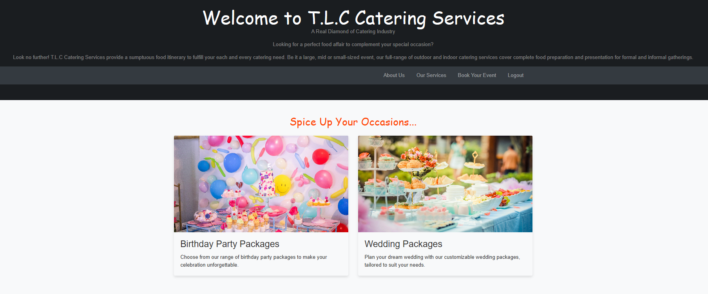
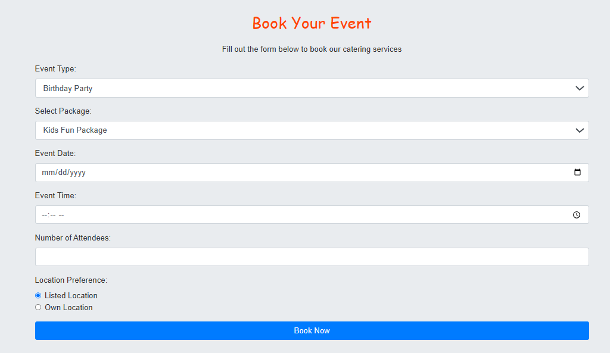
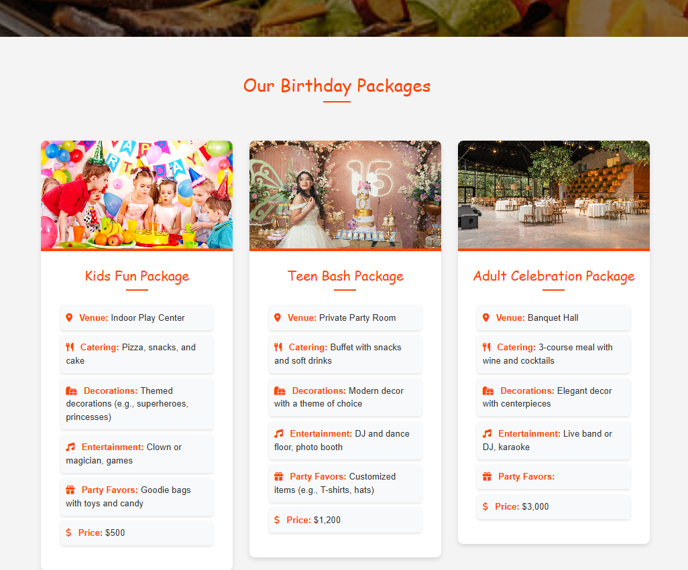

# T.L.C_Catering_Company_Website
The Catering Services Booking Application is a web-based platform designed to facilitate the 
booking and management of events such as weddings and birthday parties. It offers users 
the ability to view various event packages, make bookings, and contact the service provider 
through a contact form. The application also includes user authentication and 
administrative features to manage event packages and inquiries.

# Technologies Used
- **HTML5**: Markup language for creating the structure of the web pages.
- **CSS3**: Stylesheet language for styling the web pages.
- **JavaScript**: Adds interactivity to the web pages.
- **Bootstrap**: Front-end framework for responsive and mobile-first design.
- **Python (Flask)**: Back-end framework for handling server-side logic.
- **Jinja2**: Template engine for rendering HTML templates in Flask.
- **SQLite**: Lightweight SQL database used for development.

## More Information

Please go through [Documentation](Documentation.pdf) for more information.

